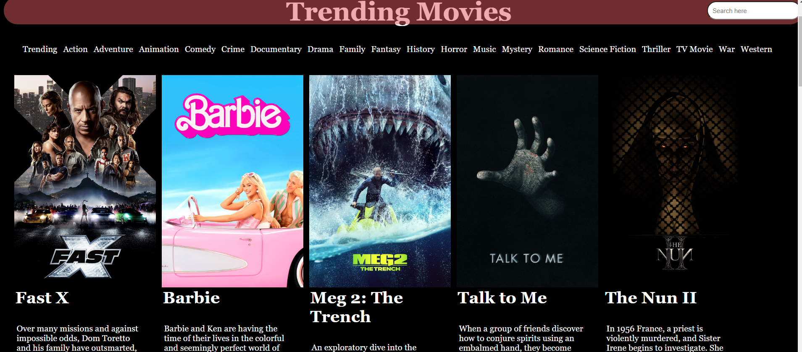

# Jenkins_CICD_Project
#### Video Demo:  <https://www.youtube.com/watch?v=D75Pr0pGz_c>
#### Website:     <http://movieapp.movieapp.cloud>
#### Description:
I Created a Jenkins Pipeline to automate web app deployment.
The application uses FetchApi to display content from The MovieDB. There are 20 different tabs for each genre. Each tab pulls an array of 20 of the daily top ranking movies. It changes and updates daily. The user has the ability to search for certin movies. The app displays the searched movie and any other movies with that search term.

## Files:
### **Root Folder**

### **Templetes Folder**

### **Script Folder**

### **Static Folder**
